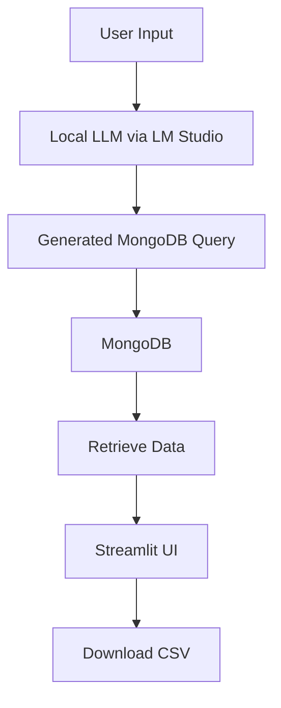

# 🔍 AI-Powered MongoDB Query Generator

[](https://streamlit.io/)  
[](https://mongodb.com)  
[](https://lmstudio.ai/)  
[](https://langchain.com/)

An AI-powered tool that converts natural language questions into executable MongoDB queries using local LLMs via LM Studio.

---

## ✨ Features

- **Natural Language Processing**: Convert plain English questions to MongoDB queries.
- **Schema-Aware Generation**: Automatically reference the database schema and data types.
- **Local LLM Integration**: Uses LM Studio for private, offline AI processing.
- **One-Click Execution**: Run queries directly from the interface.
- **CSV Export**: Download results in spreadsheet format.
- **Error Resilient**: Automatic syntax correction and query validation.
- **Interactive Schema Documentation**: Sidebar displays the collection schema for reference.

---

## 🛠 Tech Stack

| Technology  | Purpose                                      |
|-------------|----------------------------------------------|
| LM Studio   | Local LLM management & inference             |
| Streamlit   | Web interface & user interaction             |
| MongoDB     | Database storage & query execution           |
| LangChain   | LLM prompt engineering & integration         |
| Python      | Backend logic & data processing              |

---

## 🚀 Installation

### Prerequisites

- Python 3.9+
- [LM Studio](https://lmstudio.ai/) installed and configured
- MongoDB Atlas or Compass set up

### Steps

1. **Clone the Repository**

   ```bash
   git clone https://github.com/yourusername/mongodb-query-generator.git
   cd mongodb-query-generator
   ```

2. **Install Dependencies**

   ```bash
   pip install -r requirements.txt
   ```

3. **Configuration**

   - Create a `.env` file in the project root with the following content:

     ```bash
     MONGO_URI="your_mongodb_connection_string"
     DB_NAME="your_database_name"
     COLLECTION_NAME="products"
     ```

   - Create a `database_schema.json` file (sample provided):

     ```json
     {
       "collection": "products",
       "fields": {
         "ProductID": {"type": "string"},
         "Name": {"type": "string"},
         "Price": {"type": "float", "example": 29.99},
         "Category": {"type": "string"},
         "Rating": {"type": "float", "range": [0, 5]},
         "Reviews": {"type": "int"},
         "Brand": {"type": "string"},
         "LaunchDate": {"type": "ISODate"},
         "Discount": {"type": "int"}
       }
     }
     ```

3. **LM Studio Setup**

   - Launch LM Studio.
   - Load your preferred LLM (e.g., Mistral 7B or another model).
   - Start the local server (set the server port, e.g., 1234).

---

## 🖥 Usage

1. **Start the Application**

   ```bash
   streamlit run app.py
   ```

2. **Interface Guide**

   - **Left Sidebar**: Displays interactive documentation for the database schema.
   - **Main Panel**:
     - **Step 1**: Input your natural language instruction (e.g., "What are the products with a price greater than $50?").
     - **Step 2**: Click **"Generate Query"** to see the MongoDB query generated by the LLM.
     - **Step 3**: Modify or confirm the query and click **"Execute Query"** to run it against your MongoDB database.
     - **Results**: View the query results in a table and download the output as a CSV file if desired.

---

## 📊 Architecture



---

## 📄 Code Overview

- **llm_query_generator.py**: Generates MongoDB queries using a local LLM.
- **app.py**: Streamlit web application interface.
- **requirements.txt**: Lists all necessary Python dependencies.

---

